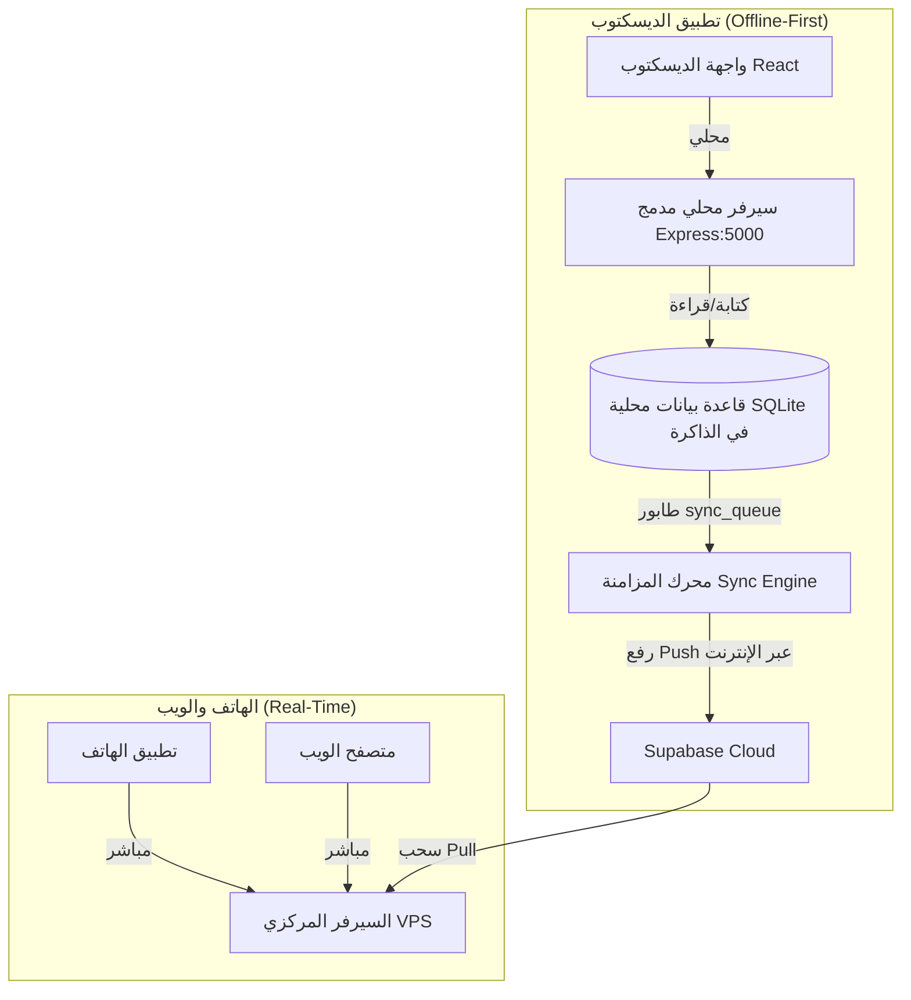

# تقرير الفحص الشامل لبنية تطبيق الديسكتوب (Desktop App Architecture & Sync Audit)

تم إجراء فحص شامل وكامل لجميع طبقات تطبيق الديسكتوب (`Electron` + `Embedded Express` + `SQLite/sql.js` + `Sync Engine` + `Frontend React`) ومقارنتها مع بنية الويب والموبايل.

---

## 1. الفارق الأساسي بين بنية الديسكتوب والويب/الهاتف



---

## 2. المشكلات والاختناقات المكتشفة في كود الديسكتوب (Root Causes)

### 🔴 1. خمول وتجميد المؤقتات عند تصغير نافذة الديسكتوب (Electron Background Throttling)
* **الموقع:** [`client/electron/main.cjs`](file:///c:/Users/moham/OneDrive/Desktop/Cyber%20Caf%C3%A9/cyber-project/client/electron/main.cjs#L57-L73)
* **المشكلة:** متصفح Chromium المدمج في Electron يقوم تلقائياً بـ **تجميد وتقليل سرعة المؤقتات (`setInterval` و `setTimeout`)** بمجرد تصغير النافذة أو نقل التركيز لبرنامج آخر، لعدم وجود إعداد `backgroundThrottling: false`.
* **النتيجة:** عندما يكون تطبيق الديسكتوب مفتوحاً في الخلفية، يتوقف أو يتأخر فحص وتحديث البيانات لعدة دقائق بدلاً من الثواني المحددة.

---

### 🔴 2. تنفيذ طلبات المزامنة بالتتابع البطيء (Sequential Blocking Network Calls)
* **الموقع:** [`server/src/lib/sync-engine.ts`](file:///c:/Users/moham/OneDrive/Desktop/Cyber%20Caf%C3%A9/cyber-project/server/src/lib/sync-engine.ts#L776-L835)
* **المشكلة:** 
  * في مرحلة الرفع (**Push**): إذا كان هناك 20 عملية في الطابور، يقوم المحرك بعمل 20 طلب HTTP منفصل واحداً تلو الآخر (`for ... await cloudSupabase.upsert`).
  * في مرحلة السحب (**Pull**): يقوم المحرك بطلب 15 جدولاً بالتتابع (Users ثم Devices ثم Customers ثم Products ... إلى 15 جدولاً).
* **النتيجة:** كل دورة مزامنة تأخذ وقتاً طويلاً جداً (بين 4 إلى 8 ثوانٍ على شبكات الإنترنت العادية)، مما يجعل قفل `_isSyncing = true` يستمر طويلاً ويمنع الدورات التالية.

---

### 🔴 3. خطأ حرج: عدم مزامنة تعديلات المنتجات والمخزون في السحب (Incremental Pull Bug)
* **الموقع:** [`server/src/lib/sync-engine.ts:L223`](file:///c:/Users/moham/OneDrive/Desktop/Cyber%20Caf%C3%A9/cyber-project/server/src/lib/sync-engine.ts#L223)
* **المشكلة:** كود سحب المنتجات من السحابة يفحص تاريخ الإنشاء فقط:
  ```typescript
  if (lastProdSynced) prodQuery = prodQuery.gt('created_at', lastProdSynced);
  ```
* **النتيجة:** إذا تم **تعديل سعر منتج** أو **تعديل كمية المخزون** على الويب، فلن تصل هذه التعديلات أبداً لتطبيق الديسكتوب لأن تاريخ إنشاء المنتج (`created_at`) لم يتغير! (يجب أن يكون `updated_at`).

---

### 🔴 4. تخطي السجلات المعلقة بشكل نهائي عند حدوث خطأ مؤقت (Permanent Skip on Error)
* **الموقع:** [`server/src/lib/sync-engine.ts:L828-L835`](file:///c:/Users/moham/OneDrive/Desktop/Cyber%20Caf%C3%A9/cyber-project/server/src/lib/sync-engine.ts#L828-L835)
* **المشكلة:** إذا فشلت مزامنة جلسة بسبب تأخر وصول العميل المرتبط بها (Foreign Key Constraint)، يقوم النظام بتعليم العملية كـ `synced = 2` (Skipped) ولا يحاول مزامنتها مرة أخرى على الإطلاق!
* **النتيجة:** ضياع بعض الجلسات أو الفواتير من المزامنة تماماً حتى يتم تعديلها يدوياً.

---

### 🔴 5. غياب Realtime WebSockets في الديسكتوب والاعتماد الكلي على الـ Polling
* **الموقع:** [`client/src/hooks/usePolling.ts`](file:///c:/Users/moham/OneDrive/Desktop/Cyber%20Caf%C3%A9/cyber-project/client/src/hooks/usePolling.ts)
* **المشكلة:** النظام لا يستمع لتنبيهات Supabase Realtime (WebSockets) في واجهة الديسكتوب، بل يعتمد على مؤقت دوري لطلب البيانات (`Pull Polling`).

---

## 3. خطة المعالجة والتحسينات الموصى بها

| رقم | الإجراء التقني المطلوب | الفائدة |
| :--- | :--- | :--- |
| **1** | إضافة `backgroundThrottling: false` في `main.cjs` | استمرار المزامنة بكامل سرعتها حتى لو كانت النافذة مصغرة. |
| **2** | تحويل سحب الجداول غير المترابطة في `pullFromCloud` إلى `Promise.all` المتوازي | تقليل زمن دورة السحب من 5 ثوانٍ إلى أقل من 0.8 ثانية. |
| **3** | إصلاح فلتر المنتجات والمخزون ليعتمد على `updated_at` | ضمان وصول أسعار المنتجات والمخزون المعدل للديسكتوب فوراً. |
| **4** | إضافة Retry Mechanism للأخطاء المؤقتة في `sync_queue` بدلاً من تجاهلها (`synced = 2`) | عدم فقدان أي فاتورة أو جلسة نهائياً. |
| **5** | دمج إرسال دفعي (Batch Upsert) للسجلات في `sync-engine` بدلاً من إرسال سجل تلو الآخر | سرعة فائقة في رفع البيانات المعلقة. |
